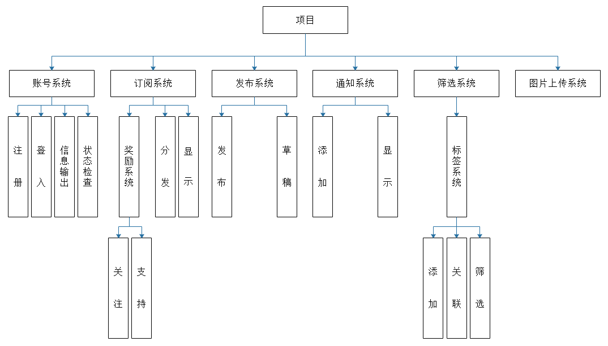
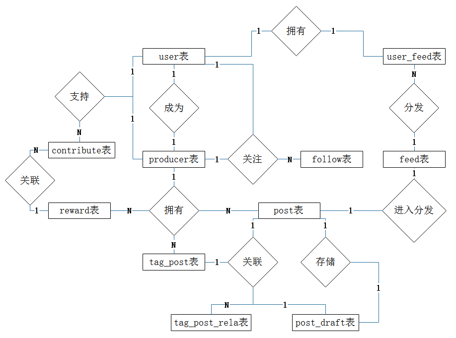
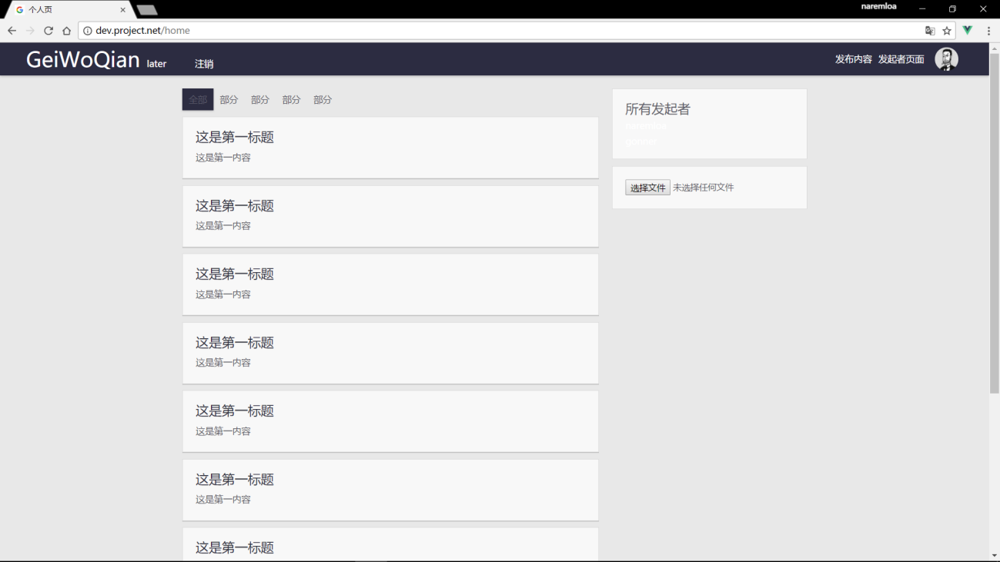
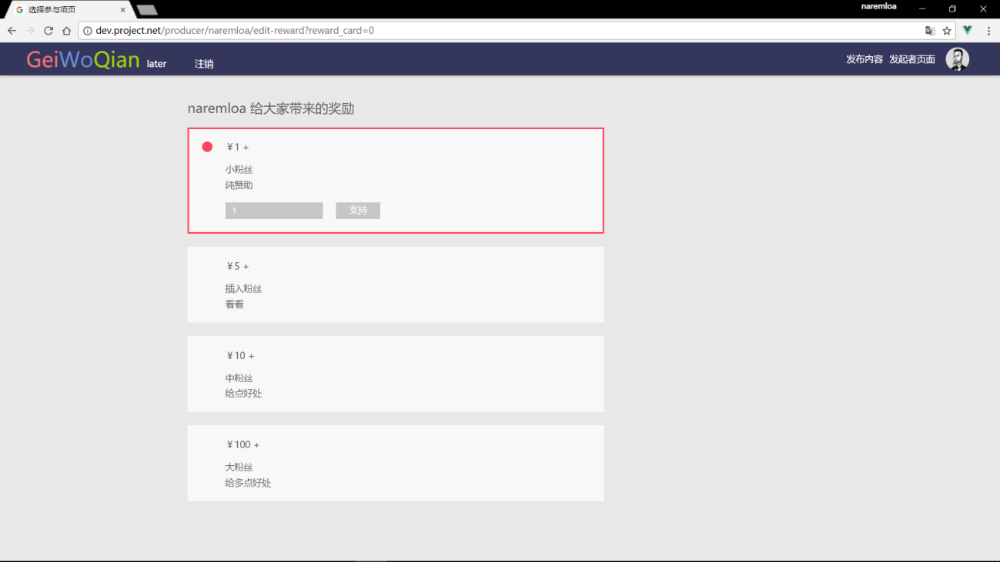
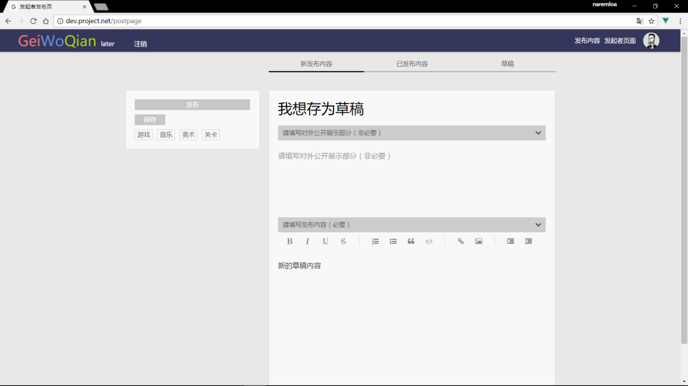
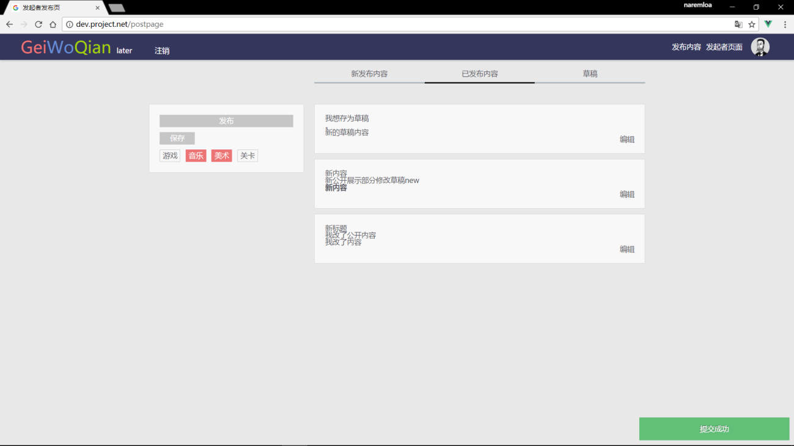

# 眾籌(Crowdfunding, 群募)平台
### 1.介紹
相對網路上現存的大多數眾籌網站是以發起項目為眾籌單位的形式，這裡所設計的是以發起人為眾籌單位的形式。該類型最為成功的例子是Patreon。但對Patreon本身來說，它所採用的模式及偏重（線下商務模式，patreon減少了參與眾籌雙方的即時交流，更多是當純粹的收入途徑之一）已經有點偏離了眾籌這個概念（或者反過來說，若是不偏離眾籌這個概念可能就成功不了了（？？？）。

項目的目標放在平台社交上。

### 2.平台功能
功能結構：

ER：

### 3.技術棧
後端框架採用Laravel

數據庫存儲採用mysql + Redis混合

前端框架採用Vue + jQuery混合

### 4.項目部分截圖

